# 毕设简介

## 一、论文学习

> Nguyen T T, Nguyen Q V H, Nguyen C M, et al. Deep learning for deepfakes creation and detection: A survey[J]. arXiv preprint arXiv:1909.11573, 2019. [[PDF] arxiv.org](https://arxiv.org/pdf/1909.11573.pdf)

### 1.Introduction

deepfake 分为两大类

- lip-sync：嘴唇仿照声音
- pupper-master：换脸不换身

---

### 2.deepfake Creation

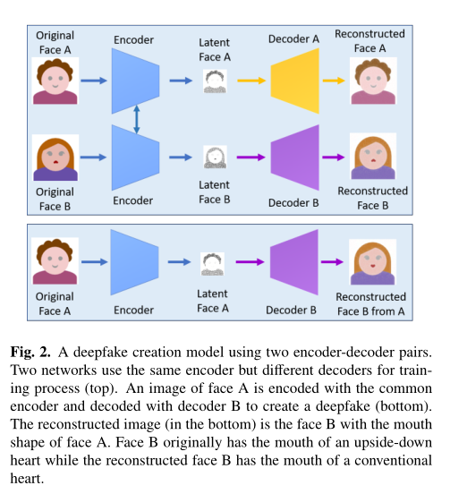

使用两个编码器-解码器对的deepfake创建模型。两个网络使用相同的编码器但不同的解码器进行训练（上图）。面部A的图像用通用编码器编码，并用解码器B解码，以创建深假（底部）。重建图像（在底部）是面部B，其嘴形状为面部A。面部B最初具有倒置心脏的嘴，而重建的面部B具有常规心脏的嘴。

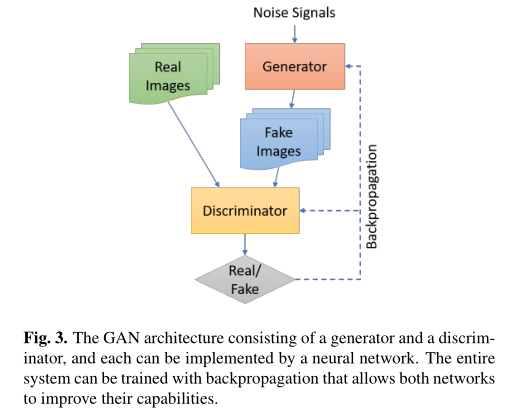

GAN结构由一个发生器和一个鉴别器组成，每一个都可以通过神经网络实现。整个系统可以通过反向传播进行训练，使两个网络都能提高其能力。 

传统的GAN模型包括两个神经网络：**生成器** 和 **鉴别器**，如图3所示。给定具有$p_{data}$分布的真实图像x的数据集，生成器D的目的是生成与真实图像x相似的图像G(z)，其中z是具有$p_{z}$分布的噪声信号。鉴别器G的目的是正确分类由G生成的图像和真实图像x。鉴别器D经过训练以提高其分类能力，即最大化D(x)，其表示x是真实图像而不是由G生成的假图像的概率。另一方面，G被训练以最小化其输出被D分类为合成图像的概率，即最小化1 − D(G(z))。这是两个玩家D和G之间的极小极大博弈，可以用下面的值函数来描述：

$\min\limits_G\max\limits_DV(D,G) = \mathbb{E}_{x\sim p_{data}(x)}[\log D(x)] + \mathbb{E}_{z\sim p_{z}(z)}[\log (1-D(G(z)))]$

---

### 3.deepfake Detection

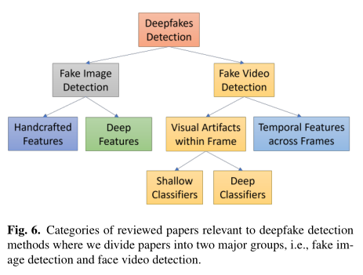

本节介绍了deepfake检测方法的概况，我们将其分为两大类：**假图像检测方法** 和 **假视频检测方法**（见图6）。

前者分为 **手动提取特征再分类** 和 **深度学习提取特征再分类** 。

后者分为两个较小的组：**基于单个视频帧的方法中的视觉伪影** 和 **基于帧的方法中的时间特征** 。虽然大多数基于时间特征的方法使用深度学习递归分类模型，但这些方法使用视频帧中的视觉伪影，可以通过 **深度或浅层分类器** 实现。 

3.2.1.

跨视频帧的时间特征

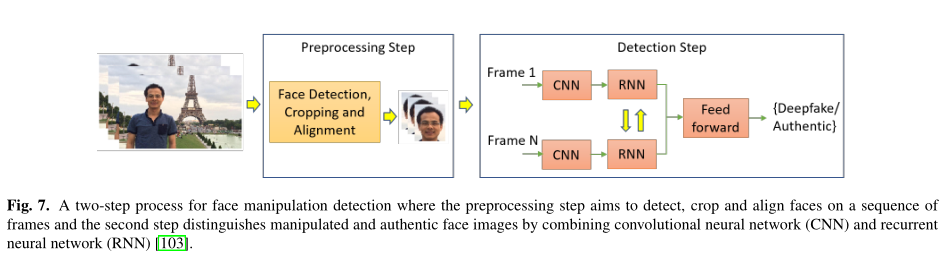

Sabir等人[103]观察到，在deepfakes的合成过程中，时间一致性没有得到有效增强，因此利用视频流的时空特征来检测deepfakes。视频处理是在逐帧的基础上进行的，因此，面部处理产生的低水平伪影被认为进一步表现为跨帧不一致的时间伪影。基于 **卷积网络DenseNet** [62]和 **选通递归单元** [111]的集成，提出了一种递归卷积模型（RCN），以利用帧间的时间差异（见图7）。该方法在FaceForensics++数据集上进行了测试，该数据集包含1000个视频[105]，并显示了令人满意的结果。 

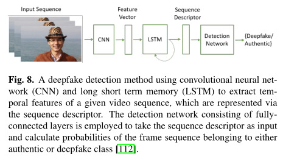

同样，Güera和Delp[112]强调了deepfake视频包含帧内不一致和帧间时间不一致。然后，他们提出了时间感知管道方法，该方法使用 **CNN和长短时记忆（LSTM）** 来检测假视频。CNN用于提取帧级特征，然后将其输入LSTM以创建时间序列描述符。最后，一个完全连接的网络用于基于序列描述符将篡改视频与真实视频进行分类，如图8所示。使用包含600个视频的数据集获得了大于97%的准确率，其中包括从多个视频托管网站收集的300个假视频，以及从[113]中的好莱坞人类行为数据集中随机选择的300个原始视频。 

眨眼频率，光流场，等也会被用来分辨真假视频。

3.2.2.

视频帧中的视觉伪影

*Deep classifiers.*

[120]中提出了一种基于deepfake生成算法的人脸扭曲步骤中观察到的伪影来检测deepfake的深度学习方法。 

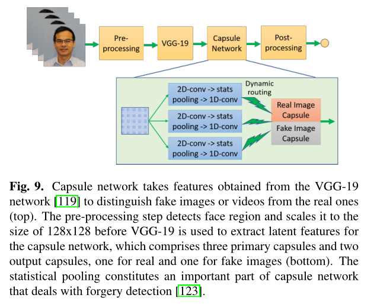

基于动态路由算法[125]的胶囊网络的最新发展表明，它能够描述对象部件之间的层次式姿势关系。如图9所示，该开发被用作检测伪造图像和视频的管道中的一个组件。采用动态路由算法，通过多次迭代将三个胶囊的输出路由到输出胶囊，以分离假图像和真实图像。

*Shallow classifiers.*

使用眼睛特征向量、牙齿特征向量和从全脸裁剪中提取的特征。在提取特征后，采用logistic回归和小神经网络两种分类器对真实视频中的假货进行分类。在从YouTube下载的视频数据集上进行的实验显示，就接收器工作特性曲线下的面积而言，最佳结果为0.851。

[131]中提出了使用光响应不均匀性（PRNU）分析来检测真假。PRNU是传感器图案噪声的一个组成部分，其原因是硅片的制造缺陷，以及由于硅片物理特性的变化，像素对光的敏感度不一致。拍照时，传感器缺陷以不可见噪声的形式引入内容的高频带。因为硅片上的缺陷并不均匀，所以即使是由硅片制成的传感器也会产生独特的PRNU。因此，PRNU通常被认为是相机在图像中留下的数码相机指纹[132]。

Hasan和Salah[137]提出使用区块链和智能合约来帮助用户检测假视频，前提是视频只有在来源可追踪时才是真实的。

---

### 4.discussion

值得注意的是，使用高级机器学习来创建deepfakes的人与努力检测deepfakes的人之间的斗争正在加剧。 

---

## 二、代码部分

### 1.实验一：手动特征+SVM分类器

代码详见文件夹 [imagedetection](./imagedetection/)

数据：CelebA & PGGAN 

baidu link: https://pan.baidu.com/s/1zjONBZZgDypsGqkUP2Aeww?pwd=3e07 code: 3e07

方法：光谱特征 + SVM

光谱图：

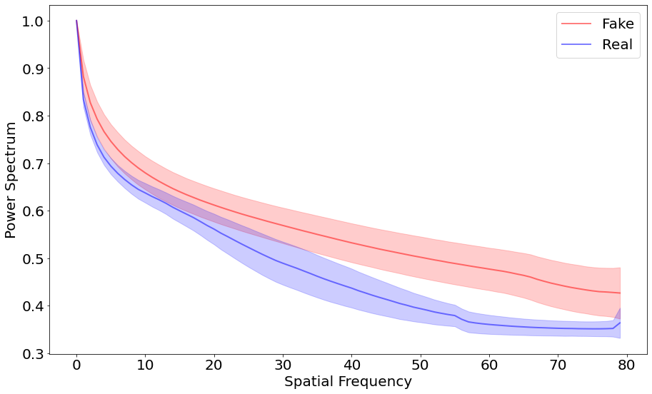

结果：

```py
Average SVM: 0.9895000000000002
Average SVM_r: 0.99875
Average SVM_p: 0.9962500000000002
Average LR: 0.9644999999999999
```

### 2.实验二：深度学习分类器

代码详见文件夹 [videodetection](./videodetection/)

数据集：

Preprocessed data
  - [FaceForensics++ Real and fake processed videos](https://drive.google.com/drive/folders/1VIIWRLs6VBXRYKODgeOU7i6votLPPxT0?usp=sharing)
  - [Celeb-DF Fake processed videos](https://drive.google.com/drive/folders/1SxCb_Wr7N4Wsc-uvjUl0i-6PpwYmwN65?usp=sharing)
  - [Celeb-DF Real processed videos](https://drive.google.com/drive/folders/1g97v9JoD3pCKA2TxHe8ZLRe4buX2siCQ?usp=sharing)
  - [DFDC Fake processed videos](https://drive.google.com/drive/folders/1yz3DBeFJvZ_QzWsyY7EwBNm7fx4MiOfF?usp=sharing)
  - [DFDC Real processed videos](https://drive.google.com/drive/folders/1wN3ZOd0WihthEeH__Lmj_ENhoXJN6U)

方法：ResNet + LSTM

相关数据：

```
train :  1589
test :  398
TRAIN:  Real: 803  Fake: 786
TEST:  Real: 189  Fake: 209
len(train_loader):  397  len(valid_loader):  99
```

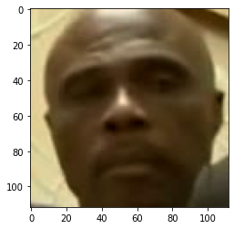

实验loss，accuracy，confusion_matrix图像：

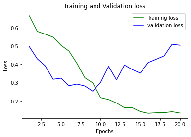

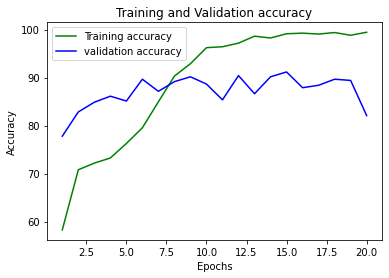

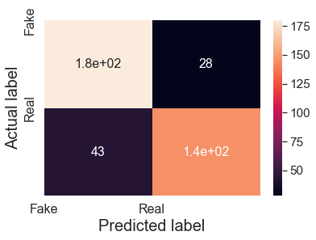

网络：

<details>
<summary>View contents</summary>

```py
DataParallel(
    (module): Model(
        (model): Sequential(
            (0): Conv2d(3, 64, kernel_size=(7, 7), stride=(2, 2), padding=(3, 3), bias=False)
            (1): BatchNorm2d(64, eps=1e-05, momentum=0.1, affine=True, track_running_stats=True)
            (2): ReLU(inplace=True)
            (3): MaxPool2d(kernel_size=3, stride=2, padding=1, dilation=1, ceil_mode=False)
            (4): Sequential(
                (0): Bottleneck(
                    (conv1): Conv2d(64, 128, kernel_size=(1, 1), stride=(1, 1), bias=False)
                    (bn1): BatchNorm2d(128, eps=1e-05, momentum=0.1, affine=True, track_running_stats=True)
                    (conv2): Conv2d(128, 128, kernel_size=(3, 3), stride=(1, 1), padding=(1, 1), groups=32, bias=False)
                    (bn2): BatchNorm2d(128, eps=1e-05, momentum=0.1, affine=True, track_running_stats=True)
                    (conv3): Conv2d(128, 256, kernel_size=(1, 1), stride=(1, 1), bias=False)
                    (bn3): BatchNorm2d(256, eps=1e-05, momentum=0.1, affine=True, track_running_stats=True)
                    (relu): ReLU(inplace=True)
                    (downsample): Sequential(
                        (0): Conv2d(64, 256, kernel_size=(1, 1), stride=(1, 1), bias=False)
                        (1): BatchNorm2d(256, eps=1e-05, momentum=0.1, affine=True, track_running_stats=True)
                    )
                )
                (1): Bottleneck(
                    (conv1): Conv2d(256, 128, kernel_size=(1, 1), stride=(1, 1), bias=False)
                    (bn1): BatchNorm2d(128, eps=1e-05, momentum=0.1, affine=True, track_running_stats=True)
                    (conv2): Conv2d(128, 128, kernel_size=(3, 3), stride=(1, 1), padding=(1, 1), groups=32, bias=False)
                    (bn2): BatchNorm2d(128, eps=1e-05, momentum=0.1, affine=True, track_running_stats=True)
                    (conv3): Conv2d(128, 256, kernel_size=(1, 1), stride=(1, 1), bias=False)
                    (bn3): BatchNorm2d(256, eps=1e-05, momentum=0.1, affine=True, track_running_stats=True)
                    (relu): ReLU(inplace=True)
                )
                (2): Bottleneck(
                    (conv1): Conv2d(256, 128, kernel_size=(1, 1), stride=(1, 1), bias=False)
                    (bn1): BatchNorm2d(128, eps=1e-05, momentum=0.1, affine=True, track_running_stats=True)
                    (conv2): Conv2d(128, 128, kernel_size=(3, 3), stride=(1, 1), padding=(1, 1), groups=32, bias=False)
                    (bn2): BatchNorm2d(128, eps=1e-05, momentum=0.1, affine=True, track_running_stats=True)
                    (conv3): Conv2d(128, 256, kernel_size=(1, 1), stride=(1, 1), bias=False)
                    (bn3): BatchNorm2d(256, eps=1e-05, momentum=0.1, affine=True, track_running_stats=True)
                    (relu): ReLU(inplace=True)
                )
            )
            (5): Sequential(
                (0): Bottleneck(
                    (conv1): Conv2d(256, 256, kernel_size=(1, 1), stride=(1, 1), bias=False)
                    (bn1): BatchNorm2d(256, eps=1e-05, momentum=0.1, affine=True, track_running_stats=True)
                    (conv2): Conv2d(256, 256, kernel_size=(3, 3), stride=(2, 2), padding=(1, 1), groups=32, bias=False)
                    (bn2): BatchNorm2d(256, eps=1e-05, momentum=0.1, affine=True, track_running_stats=True)
                    (conv3): Conv2d(256, 512, kernel_size=(1, 1), stride=(1, 1), bias=False)
                    (bn3): BatchNorm2d(512, eps=1e-05, momentum=0.1, affine=True, track_running_stats=True)
                    (relu): ReLU(inplace=True)
                    (downsample): Sequential(
                        (0): Conv2d(256, 512, kernel_size=(1, 1), stride=(2, 2), bias=False)
                        (1): BatchNorm2d(512, eps=1e-05, momentum=0.1, affine=True, track_running_stats=True)
                    )
                )
                (1): Bottleneck(
                    (conv1): Conv2d(512, 256, kernel_size=(1, 1), stride=(1, 1), bias=False)
                    (bn1): BatchNorm2d(256, eps=1e-05, momentum=0.1, affine=True, track_running_stats=True)
                    (conv2): Conv2d(256, 256, kernel_size=(3, 3), stride=(1, 1), padding=(1, 1), groups=32, bias=False)
                    (bn2): BatchNorm2d(256, eps=1e-05, momentum=0.1, affine=True, track_running_stats=True)
                    (conv3): Conv2d(256, 512, kernel_size=(1, 1), stride=(1, 1), bias=False)
                    (bn3): BatchNorm2d(512, eps=1e-05, momentum=0.1, affine=True, track_running_stats=True)
                    (relu): ReLU(inplace=True)
                )
                (2): Bottleneck(
                    (conv1): Conv2d(512, 256, kernel_size=(1, 1), stride=(1, 1), bias=False)
                    (bn1): BatchNorm2d(256, eps=1e-05, momentum=0.1, affine=True, track_running_stats=True)
                    (conv2): Conv2d(256, 256, kernel_size=(3, 3), stride=(1, 1), padding=(1, 1), groups=32, bias=False)
                    (bn2): BatchNorm2d(256, eps=1e-05, momentum=0.1, affine=True, track_running_stats=True)
                    (conv3): Conv2d(256, 512, kernel_size=(1, 1), stride=(1, 1), bias=False)
                    (bn3): BatchNorm2d(512, eps=1e-05, momentum=0.1, affine=True, track_running_stats=True)
                    (relu): ReLU(inplace=True)
                )
                (3): Bottleneck(
                    (conv1): Conv2d(512, 256, kernel_size=(1, 1), stride=(1, 1), bias=False)
                    (bn1): BatchNorm2d(256, eps=1e-05, momentum=0.1, affine=True, track_running_stats=True)
                    (conv2): Conv2d(256, 256, kernel_size=(3, 3), stride=(1, 1), padding=(1, 1), groups=32, bias=False)
                    (bn2): BatchNorm2d(256, eps=1e-05, momentum=0.1, affine=True, track_running_stats=True)
                    (conv3): Conv2d(256, 512, kernel_size=(1, 1), stride=(1, 1), bias=False)
                    (bn3): BatchNorm2d(512, eps=1e-05, momentum=0.1, affine=True, track_running_stats=True)
                    (relu): ReLU(inplace=True)
                )
            )
            (6): Sequential(
                (0): Bottleneck(
                    (conv1): Conv2d(512, 512, kernel_size=(1, 1), stride=(1, 1), bias=False)
                    (bn1): BatchNorm2d(512, eps=1e-05, momentum=0.1, affine=True, track_running_stats=True)
                    (conv2): Conv2d(512, 512, kernel_size=(3, 3), stride=(2, 2), padding=(1, 1), groups=32, bias=False)
                    (bn2): BatchNorm2d(512, eps=1e-05, momentum=0.1, affine=True, track_running_stats=True)
                    (conv3): Conv2d(512, 1024, kernel_size=(1, 1), stride=(1, 1), bias=False)
                    (bn3): BatchNorm2d(1024, eps=1e-05, momentum=0.1, affine=True, track_running_stats=True)
                    (relu): ReLU(inplace=True)
                    (downsample): Sequential(
                        (0): Conv2d(512, 1024, kernel_size=(1, 1), stride=(2, 2), bias=False)
                        (1): BatchNorm2d(1024, eps=1e-05, momentum=0.1, affine=True, track_running_stats=True)
                    )
                )
                (1): Bottleneck(
                    (conv1): Conv2d(1024, 512, kernel_size=(1, 1), stride=(1, 1), bias=False)
                    (bn1): BatchNorm2d(512, eps=1e-05, momentum=0.1, affine=True, track_running_stats=True)
                    (conv2): Conv2d(512, 512, kernel_size=(3, 3), stride=(1, 1), padding=(1, 1), groups=32, bias=False)
                    (bn2): BatchNorm2d(512, eps=1e-05, momentum=0.1, affine=True, track_running_stats=True)
                    (conv3): Conv2d(512, 1024, kernel_size=(1, 1), stride=(1, 1), bias=False)
                    (bn3): BatchNorm2d(1024, eps=1e-05, momentum=0.1, affine=True, track_running_stats=True)
                    (relu): ReLU(inplace=True)
                )
                (2): Bottleneck(
                    (conv1): Conv2d(1024, 512, kernel_size=(1, 1), stride=(1, 1), bias=False)
                    (bn1): BatchNorm2d(512, eps=1e-05, momentum=0.1, affine=True, track_running_stats=True)
                    (conv2): Conv2d(512, 512, kernel_size=(3, 3), stride=(1, 1), padding=(1, 1), groups=32, bias=False)
                    (bn2): BatchNorm2d(512, eps=1e-05, momentum=0.1, affine=True, track_running_stats=True)
                    (conv3): Conv2d(512, 1024, kernel_size=(1, 1), stride=(1, 1), bias=False)
                    (bn3): BatchNorm2d(1024, eps=1e-05, momentum=0.1, affine=True, track_running_stats=True)
                    (relu): ReLU(inplace=True)
                )
                (3): Bottleneck(
                    (conv1): Conv2d(1024, 512, kernel_size=(1, 1), stride=(1, 1), bias=False)
                    (bn1): BatchNorm2d(512, eps=1e-05, momentum=0.1, affine=True, track_running_stats=True)
                    (conv2): Conv2d(512, 512, kernel_size=(3, 3), stride=(1, 1), padding=(1, 1), groups=32, bias=False)
                    (bn2): BatchNorm2d(512, eps=1e-05, momentum=0.1, affine=True, track_running_stats=True)
                    (conv3): Conv2d(512, 1024, kernel_size=(1, 1), stride=(1, 1), bias=False)
                    (bn3): BatchNorm2d(1024, eps=1e-05, momentum=0.1, affine=True, track_running_stats=True)
                    (relu): ReLU(inplace=True)
                )
                (4): Bottleneck(
                    (conv1): Conv2d(1024, 512, kernel_size=(1, 1), stride=(1, 1), bias=False)
                    (bn1): BatchNorm2d(512, eps=1e-05, momentum=0.1, affine=True, track_running_stats=True)
                    (conv2): Conv2d(512, 512, kernel_size=(3, 3), stride=(1, 1), padding=(1, 1), groups=32, bias=False)
                    (bn2): BatchNorm2d(512, eps=1e-05, momentum=0.1, affine=True, track_running_stats=True)
                    (conv3): Conv2d(512, 1024, kernel_size=(1, 1), stride=(1, 1), bias=False)
                    (bn3): BatchNorm2d(1024, eps=1e-05, momentum=0.1, affine=True, track_running_stats=True)
                    (relu): ReLU(inplace=True)
                )
                (5): Bottleneck(
                    (conv1): Conv2d(1024, 512, kernel_size=(1, 1), stride=(1, 1), bias=False)
                    (bn1): BatchNorm2d(512, eps=1e-05, momentum=0.1, affine=True, track_running_stats=True)
                    (conv2): Conv2d(512, 512, kernel_size=(3, 3), stride=(1, 1), padding=(1, 1), groups=32, bias=False)
                    (bn2): BatchNorm2d(512, eps=1e-05, momentum=0.1, affine=True, track_running_stats=True)
                    (conv3): Conv2d(512, 1024, kernel_size=(1, 1), stride=(1, 1), bias=False)
                    (bn3): BatchNorm2d(1024, eps=1e-05, momentum=0.1, affine=True, track_running_stats=True)
                    (relu): ReLU(inplace=True)
                )
            )
            (7): Sequential(
                (0): Bottleneck(
                    (conv1): Conv2d(1024, 1024, kernel_size=(1, 1), stride=(1, 1), bias=False)
                    (bn1): BatchNorm2d(1024, eps=1e-05, momentum=0.1, affine=True, track_running_stats=True)
                    (conv2): Conv2d(1024, 1024, kernel_size=(3, 3), stride=(2, 2), padding=(1, 1), groups=32, bias=False)
                    (bn2): BatchNorm2d(1024, eps=1e-05, momentum=0.1, affine=True, track_running_stats=True)
                    (conv3): Conv2d(1024, 2048, kernel_size=(1, 1), stride=(1, 1), bias=False)
                    (bn3): BatchNorm2d(2048, eps=1e-05, momentum=0.1, affine=True, track_running_stats=True)
                    (relu): ReLU(inplace=True)
                    (downsample): Sequential(
                        (0): Conv2d(1024, 2048, kernel_size=(1, 1), stride=(2, 2), bias=False)
                        (1): BatchNorm2d(2048, eps=1e-05, momentum=0.1, affine=True, track_running_stats=True)
                    )
                )
                (1): Bottleneck(
                    (conv1): Conv2d(2048, 1024, kernel_size=(1, 1), stride=(1, 1), bias=False)
                    (bn1): BatchNorm2d(1024, eps=1e-05, momentum=0.1, affine=True, track_running_stats=True)
                    (conv2): Conv2d(1024, 1024, kernel_size=(3, 3), stride=(1, 1), padding=(1, 1), groups=32, bias=False)
                    (bn2): BatchNorm2d(1024, eps=1e-05, momentum=0.1, affine=True, track_running_stats=True)
                    (conv3): Conv2d(1024, 2048, kernel_size=(1, 1), stride=(1, 1), bias=False)
                    (bn3): BatchNorm2d(2048, eps=1e-05, momentum=0.1, affine=True, track_running_stats=True)
                    (relu): ReLU(inplace=True)
                )
                (2): Bottleneck(
                    (conv1): Conv2d(2048, 1024, kernel_size=(1, 1), stride=(1, 1), bias=False)
                    (bn1): BatchNorm2d(1024, eps=1e-05, momentum=0.1, affine=True, track_running_stats=True)
                    (conv2): Conv2d(1024, 1024, kernel_size=(3, 3), stride=(1, 1), padding=(1, 1), groups=32, bias=False)
                    (bn2): BatchNorm2d(1024, eps=1e-05, momentum=0.1, affine=True, track_running_stats=True)
                    (conv3): Conv2d(1024, 2048, kernel_size=(1, 1), stride=(1, 1), bias=False)
                    (bn3): BatchNorm2d(2048, eps=1e-05, momentum=0.1, affine=True, track_running_stats=True)
                    (relu): ReLU(inplace=True)
                )
            )
        )
        (avgpool): AdaptiveAvgPool2d(output_size=1)
        (lstm): LSTM(2048, 2048, bias=False)
        (relu): LeakyReLU(negative_slope=0.01)
        (linear1): Linear(in_features=2048, out_features=2, bias=True)
        (dp): Dropout(p=0.4, inplace=False)
    )
)
```
</details>

实验结果：

<details>
<summary>View contents</summary>

```py
[Epoch 1/20] [Batch 397 / 397] [Loss: 0.664535, Acc: 58.25%]
Testing
[Batch 99 / 99]  [Loss: 0.495809, Acc: 77.78%]
Accuracy 77.77777777777777 %

Training
[Epoch 2/20] [Batch 397 / 397] [Loss: 0.580121, Acc: 70.78%]
Testing
[Batch 99 / 99]  [Loss: 0.429877, Acc: 82.83%]
Accuracy 82.82828282828282 %

Training
[Epoch 3/20] [Batch 397 / 397] [Loss: 0.564626, Acc: 72.17%]
Testing
[Batch 99 / 99]  [Loss: 0.391622, Acc: 84.85%]
Accuracy 84.84848484848484 %

Training
[Epoch 4/20] [Batch 397 / 397] [Loss: 0.548298, Acc: 73.24%]
Testing
[Batch 99 / 99]  [Loss: 0.318135, Acc: 86.11%]
Accuracy 86.11111111111111 %

Training
[Epoch 5/20] [Batch 397 / 397] [Loss: 0.503691, Acc: 76.26%]
Testing
[Batch 99 / 99]  [Loss: 0.323931, Acc: 85.10%]
Accuracy 85.1010101010101 %

Training
[Epoch 6/20] [Batch 397 / 397] [Loss: 0.472223, Acc: 79.53%]
Testing
[Batch 99 / 99]  [Loss: 0.282682, Acc: 89.65%]
Accuracy 89.64646464646465 %

Training
[Epoch 7/20] [Batch 397 / 397] [Loss: 0.405582, Acc: 84.95%]
Testing
[Batch 99 / 99]  [Loss: 0.291735, Acc: 87.12%]
Accuracy 87.12121212121212 %

Training
[Epoch 8/20] [Batch 397 / 397] [Loss: 0.326274, Acc: 90.30%]
Testing
[Batch 99 / 99]  [Loss: 0.281290, Acc: 89.14%]
Accuracy 89.14141414141415 %

Training
[Epoch 9/20] [Batch 397 / 397] [Loss: 0.298311, Acc: 92.88%]
Testing
[Batch 99 / 99]  [Loss: 0.252750, Acc: 90.15%]
Accuracy 90.15151515151516 %

Training
[Epoch 10/20] [Batch 397 / 397] [Loss: 0.217693, Acc: 96.22%]
Testing
[Batch 99 / 99]  [Loss: 0.301499, Acc: 88.64%]
Accuracy 88.63636363636364 %

Training
[Epoch 11/20] [Batch 397 / 397] [Loss: 0.207441, Acc: 96.41%]
Testing
[Batch 99 / 99]  [Loss: 0.388431, Acc: 85.35%]
Accuracy 85.35353535353535 %

Training
[Epoch 12/20] [Batch 397 / 397] [Loss: 0.188564, Acc: 97.17%]
Testing
[Batch 99 / 99]  [Loss: 0.314877, Acc: 90.40%]
Accuracy 90.4040404040404 %

Training
[Epoch 13/20] [Batch 397 / 397] [Loss: 0.162513, Acc: 98.61%]
Testing
[Batch 99 / 99]  [Loss: 0.395656, Acc: 86.62%]
Accuracy 86.61616161616162 %

Training
[Epoch 14/20] [Batch 397 / 397] [Loss: 0.162211, Acc: 98.24%]
Testing
[Batch 99 / 99]  [Loss: 0.370838, Acc: 90.15%]
Accuracy 90.15151515151516 %

Training
[Epoch 15/20] [Batch 397 / 397] [Loss: 0.141267, Acc: 99.12%]
Testing
[Batch 99 / 99]  [Loss: 0.351507, Acc: 91.16%]
Accuracy 91.16161616161617 %

Training
[Epoch 16/20] [Batch 397 / 397] [Loss: 0.132064, Acc: 99.24%]
Testing
[Batch 99 / 99]  [Loss: 0.409486, Acc: 87.88%]
Accuracy 87.87878787878788 %

Training
[Epoch 17/20] [Batch 397 / 397] [Loss: 0.135001, Acc: 99.06%]
Testing
[Batch 99 / 99]  [Loss: 0.427307, Acc: 88.38%]
Accuracy 88.38383838383838 %

Training
[Epoch 18/20] [Batch 397 / 397] [Loss: 0.135301, Acc: 99.37%]
Testing
[Batch 99 / 99]  [Loss: 0.445877, Acc: 89.65%]
Accuracy 89.64646464646465 %

Training
[Epoch 19/20] [Batch 397 / 397] [Loss: 0.140848, Acc: 98.80%]
Testing
[Batch 99 / 99]  [Loss: 0.509298, Acc: 89.39%]
Accuracy 89.39393939393939 %

Training
[Epoch 20/20] [Batch 397 / 397] [Loss: 0.133202, Acc: 99.43%]
Testing
[Batch 99 / 99]  [Loss: 0.504117, Acc: 82.07%]
Accuracy 82.07070707070707 %

confusion_matrix:

[[180  28]
 [ 43 145]]
True positive =  180
False positive =  28
False negative =  43
True negative =  145
```
</details>

参考GitHub地址：

https://github.com/cc-hpc-itwm/DeepFakeDetection

https://github.com/abhijitjadhav1998/Deepfake_detection_using_deep_learning